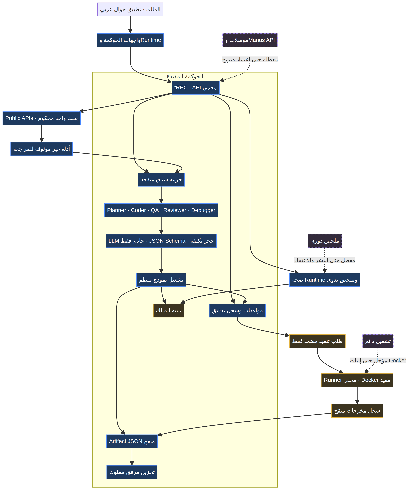
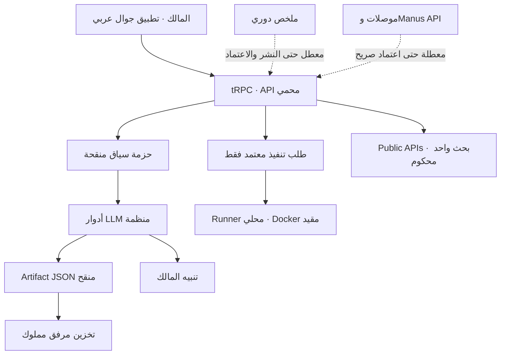

# المخطط المعماري الحي

يعرض هذا المخطط المسار الفعلي بين تطبيق الجوال والحوكمة وطبقة النماذج وتخزين الأدلة. العناصر ذات الخط المتصل تعمل داخل المشروع أو تتطلب قراراً واضحاً قبل تنفيذها. أما الأسهم المنقطة فتمثل قدرات مجهزة فقط؛ لا تملك اعتماداً أو جدولة أو بيئة Docker مثبتة بعد.

ملف المصدر `agent-command-hub-architecture.mmd` هو المرجع القابل للتعديل. يمكن إعادة توليد الصورة منه عند تغيير مسار الحوكمة أو Runner أو الموصلات.
