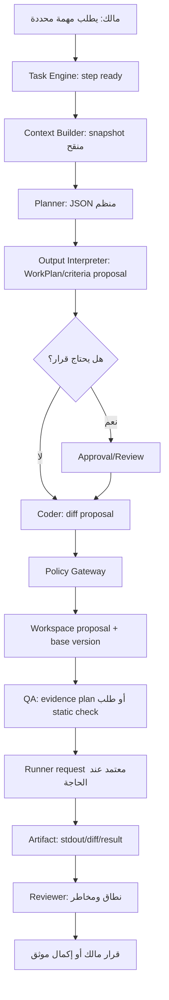

# تقرير حالة Agent Runtime وLLM Orchestration وخطة الاستكمال

**تاريخ المراجعة:** 21 أغسطس 2026  
**نطاق التقرير:** Agent Command Hub — تطبيق الجوال، API، قاعدة البيانات، العامل الدوري، Task Engine، Model Gateway، Workspace، وRunner المحلي.  
**منهج التقييم:** يفصل التقرير بين ما هو **منفّذ في الشفرة**، وما هو **متصل لكنه يدوي**، وما هو **سياسة أو تصميم مستهدف فقط**. لا يعامل وجود شاشة أو prompt أو جدول بيانات على أنه دليل لاستقلالية الوكيل أو لتنفيذ أدوات فعلية.

> **الحكم التنفيذي:** طبقة استدعاء النموذج موجودة وتعمل خادمياً ضمن حواجز جيدة: اختيار نموذج حسب الدور، مخرجات JSON مهيكلة، تنقيح محدود، حجز تكلفة، وتسجيل نجاح أو فشل. لكن **Agent Runtime ليس Runtime وكيلياً مستقلاً بعد**: لا يستهلك Task Engine مخرجات النماذج، ولا ينسق الأدوار تلقائياً، ولا يوجد Tool Registry أو دورة tool-calling أو تحويل منظم لاقتراح Coder إلى تعديل Workspace أو من حكم QA إلى دليل تشغيل. لذلك الوضع الحالي هو **Model Gateway محكوم + Task State Machine منفصلان جزئياً**، وليس حلقة وكلاء موصولة من الطلب حتى الدليل.

## 1. ملخص الحالة حسب المكوّن

| المكوّن | الحالة الحالية | ما هو مثبت فعلياً | ما لا يجب الادعاء به |
|---|---|---|---|
| اختيار النموذج | **منفذ** | يقرأ كتالوج النماذج ويختار نموذجاً مفضلاً وفق الدور المسموح. | لا يوجد Routing متعدد المزوّدين مبني على latency أو جودة أو قدرات أدوات. |
| Model Gateway | **منفذ ومقيد** | استدعاء خادمي، JSON Schema، Zod parsing، تنقيح حقول السياق، ومخرجات منظمة. | لا يوجد streaming، أو cancellation، أو timeout مستقل، أو tool calling. |
| تكلفة النموذج | **منفذ جزئياً** | حجز قبل الإرسال، تسوية عند النجاح، تحرير عند الفشل، ومنع تجاوز ميزانية المشروع. | التسعير المحجوز ثابت وفق السياسة وليس تسوية دقيقة مبنية على أسعار وقتية أو retries متعددة الأدوار. |
| أدوار النموذج | **منفذة يدوياً** | Planner وCoder وQA وReviewer وDebugger لها مخططات مخرجات وحدود prompt. | لا يوجد Orchestrator أو Release كدور نموذج قابل للتشغيل، ولا تسلسل تلقائي بين الأدوار. |
| Context | **موجود لكنه محدود** | ربط مشروع ومهمة وContextPackage وموجز مشروع، مع تنقيح نصي واقتطاع. | لا توجد بعد سياسة انتقاء محتوى فعلية تجمع ملفات ومخرجات وdiffs وأدلة اختبار في snapshot قابل للإعادة. |
| Task Engine | **آلة حالات حقيقية** | تقدم الخطوات والحالات والموافقات بصورة دائمة. | لا يستدعي نموذجاً أو أداة أو Runner بنفسه. |
| Dry Runtime/Worker | **منفذ بحدود** | يحجز أوامر وينشئ خططاً جافة ويشغّل تقدم الحالة. | لا ينفذ shell أو Git أو شبكة أو ملفات مشروع أو أدوات. |
| Tool calling | **غير موصول** | لا توجد أدوات نموذج مسجلة أو عقود tool result موحدة. | لا يمكن للوكلاء تشغيل اختبار أو قراءة ملف أو كتابة فرق عبر النموذج. |
| Runner المحلي | **حقيقي لكن محدود** | عقد طلب، موافقة، Docker مقيد، JS/TS محدود، مخرجات منقحة. | لم يثبت بعد تدفق جهاز المالك الكامل، ولا يدعم مشروعاً حقيقياً أو Git أو أدوات بناء عامة. |

## 2. ما يعمل حالياً في طبقة LLM

### 2.1 بوابة نموذج خادمية ومخرجات منظمة

تعرّف البوابة خمسة أدوار نموذجية: `planner` و`coder` و`qa` و`reviewer` و`debugger`. لكل دور JSON Schema مستقل، ثم يعاد التحقق من الناتج في الخادم عبر Zod قبل إعادته إلى الخدمة. ينفذ الاستدعاء من الخادم حصراً، ويحدد `maxTokens`، ولا يرسل إلى النموذج إلا حقولاً منقحة من اسم المشروع والمهمة والموجز وعناوين المراجع. [1]

| الدور | المخرج المهيكل الحالي | السلطة الحالية |
|---|---|---|
| Planner | ملخص، عنوان خطة، مراحل، أسئلة مفتوحة، معايير قبول، مخاطر. | اقتراح خطة فقط. |
| Coder | ملخص، مسار مستهدف، diff مقترح، افتراضات، مخاطر. | اقتراح نصي فقط؛ لا يكتب Workspace. |
| QA | PASS/FAIL، أدلة، معايير فاشلة، خطوة تالية. | تقييم الأدلة المتاحة فقط؛ لا يشغل اختبارات. |
| Reviewer | قرار مراجعة، مخاطر، تقييم نطاق، موافقات مطلوبة. | توصية فقط؛ لا يعتمد أو يطبق. |
| Debugger | تشخيص، أصغر إصلاح مقترح، اقتراح إعادة المحاولة، دليل مطلوب. | تشخيص فقط مع حد محاولتين. |

تفرض سياسة الأدوار حدوداً صحيحة في المبدأ: Coder لا يكتب الملفات أو يشغّل شيئاً، وQA لا يغير الحالة، وReviewer لا يتجاوز الموافقة، وDebugger لا يطبق إصلاحاً. كما يفرض Debugger حد محاولات واضحاً. [2]

### 2.2 الحجز والتسوية والمراجعة المالية

قبل إرسال النموذج، تتحقق طبقة البيانات من ملكية المشروع وارتباط ContextPackage بالمهمة، وتنتهي صلاحية الحجوزات القديمة، وتحتسب الإنفاق المسجل مع الحجوزات المفتوحة مقابل ميزانية المشروع. ثم تنشئ `model_cost_reservations` و`agent_model_runs` بحالة `reserved`. بعد بدء الاستدعاء تتحول الحالة إلى `running`، وعند النجاح تُخزن خلاصة ومخرج JSON وتسوّى التكلفة، وعند الفشل يحرر الحجز وتخزن خلاصة منقحة للخطأ. [3]

هذه طبقة جيدة لمنع تجاوزات ميزانية أولية، لكنها لا تغطي بعد كل المعضلات التشغيلية التالية:

| الفجوة | الأثر | الاستكمال المقترح |
|---|---|---|
| لا يوجد idempotency key لتشغيل الوكيل | تكرار طلب العميل قد ينشئ تشغيلين وتكلفتين. | مفتاح تشغيل مشتق من المهمة والدور ونسخة السياق؛ قيد uniqueness مع نافذة زمنية. |
| لا يوجد timeout أو إلغاء مستقل | قد تبقى مكالمة نموذج معلقة حتى تفشل البنية التحتية فقط. | `AbortController`، حد زمني لكل دور، وحالة `timed_out`. |
| الحجز ثابت لكل دور | قد لا يعكس الاستخدام الفعلي أو تغير السعر. | سجل تسعير/usage مستقل وتسوية من usage الحقيقي مع حد أقصى ثابت. |
| لا يوجد fallback موثق | غياب النموذج المفضل يوقف الدور كلياً. | قائمة fallback مع قرار مسجل، لا تبديل صامت. |
| لا يوجد تقييم جودة للمخرج | تطابق JSON لا يساوي جودة هندسية. | policy validator لكل دور وفحوص consistency قبل انتقال الحالة. |

## 3. لماذا لا يعد Agent Runtime مكتملًا بعد؟

### 3.1 انفصال Task Engine عن Model Gateway

Task Engine الحالي يقرأ التشغيلات النشطة ويدعو دالة تقدم حالة لكل تشغيل، ثم يحصي حالات التقدم أو الانتظار أو الحظر أو الإكمال. لا يستدعي Model Gateway أو Runner أو Workspace أو أداة محددة. [4] كذلك، Runtime الجاف ينشئ خطة منطقية ويسجلها وينادي Task Engine، لكنه يصرح صراحة بعدم تشغيل shell أو Git أو الشبكة أو أدوات النظام، وعدم قراءة أو كتابة ملفات المشروع. [5]

هذا يعني أن الشكل التالي **غير موجود بعد**:

```text
خطوة Task Engine جاهزة
  → اختيار الدور المناسب
  → بناء سياق نسخة محددة
  → حجز تكلفة واستدعاء النموذج
  → التحقق من الناتج
  → تحويل الناتج إلى Artifact / Proposal / Approval
  → الانتقال الآلي المشروط للحالة التالية
```

بدلاً من ذلك، يستطيع المستخدم أو الواجهة استدعاء دور نموذج منفرد، فتخزن الخدمة الناتج، لكن لا يوجد رابط حتمي بين المخرج وخطوة Task Engine التالية. [6]

### 3.2 مخرجات الأدوار لا تتحول إلى أفعال محكومة

المشكلة ليست في غياب النموذج، بل في غياب **طبقة تفسير مخرجات الدور**. أمثلة الفجوة:

| مخرج موجود | التحويل غير الموجود | الخطر إن فُعّل بلا طبقة تحويل |
|---|---|---|
| مراحل Planner ومعايير القبول | إنشاء/تحديث WorkPlan وTasks ومعايير قبول مع review. | يمكن للنموذج أن يغير نطاق المشروع أو ينشئ مهام مكررة. |
| `proposedDiff` من Coder | Proposal منسق مرتبط بإصدار Workspace وdiff قابل للمراجعة. | تطبيق نص غير صالح أو لمسار خارج الحدود. |
| PASS/FAIL من QA | ربط الحكم بدليل اختبار أو evidence level وتحديث خطوة المحرك. | إعلان PASS من دون تشغيل اختبار. |
| قرار Reviewer | Approval أو Review محكوم بالأثر وبسياسة المخاطر. | اعتبار توصية لغوية قراراً تنفيذياً. |
| إصلاح Debugger المقترح | طلب اختبار أو proposal جديد مع عداد محاولات. | حلقة إصلاح غير منتهية أو إعادة تنفيذ خطرة. |

> **القاعدة المطلوبة:** لا ينتقل أي JSON مولد من النموذج إلى حالة قابلة للتنفيذ مباشرة. يمر أولاً عبر `Output Interpreter` حتمي ومحدد لكل دور، ثم عبر Policy Gateway، ثم يسجل Artifact أو Proposal أو Approval قابل للمراجعة.

### 3.3 السياق الحالي وصفي أكثر من كونه سياق تنفيذ

السياق المرسل فعلياً يتضمن اسم المشروع، عنوان ووصف المهمة عند وجودهما، عنوان ContextPackage، عناوين المراجع، وحقول الموجز. لا يمرر محتوى Workspace أو محتوى Artifact أو diff أو مخرجات Runner أو نتائج اختبار فعلية ضمن snapshot موحد. [1] طبقة البيانات تتحقق من أن ContextPackage ينتمي للمشروع والمهمة، لكنها لا تنفذ بعد اختياراً تفصيلياً للمصادر أو تجميداً لنسخها عند التشغيل. [3]

هذا مناسب لتخطيط أولي، لكنه غير كافٍ لـ Coder أو QA موثوقين. الاستكمال لا يعني إرسال المستودع كاملاً؛ بل يعني **Context Builder منقح ومحدد الإصدار**.

## 4. Tool Calling: الفجوة الأكثر حساسية

لا تمرر بوابة النموذج الحالية حقل `tools` أو `tool_choice` إلى الاستدعاء؛ الاستدعاء هو طلب JSON مهيكل فقط. [1] ولذلك لا توجد حالياً أداة يستطيع الدور استدعاءها باسم أو مخطط مدخلات أو نتيجة موحدة. وجود Runner أو Workspace لا يحولها تلقائياً إلى أدوات متاحة للنموذج.

### 4.1 الهدف الصحيح: Tool Registry لا shell مفتوح

ينبغي ألا يكون الهدف «منح النموذج Terminal». الهدف هو سجل أدوات صغير، مغلق افتراضياً، لكل أداة عقد محدد:

```ts
type ToolDefinition<TInput, TResult> = {
  key: string;
  version: string;
  allowedRoles: AgentModelRole[];
  decision: "auto" | "review" | "approval";
  inputSchema: ZodSchema<TInput>;
  outputSchema: ZodSchema<TResult>;
  preconditions: (ctx: ToolContext, input: TInput) => Promise<PolicyDecision>;
  execute: (ctx: ToolContext, input: TInput) => Promise<TResult>;
  evidence: (result: TResult) => ArtifactDraft[];
};
```

| الأداة الأولى | الدور المسموح | القرار | التنفيذ | الدليل المطلوب |
|---|---|---|---|---|
| `workspace.read_selected` | Planner, Coder, QA, Reviewer | AUTO | قراءة ملفات محددة من Workspace المنطقي فقط. | معرفات الملفات وإصداراتها وسبب الاختيار. |
| `workspace.create_diff_proposal` | Coder | REVIEW | حفظ diff مقترح فقط، لا كتابة مباشرة. | base version وdiff وملخص المخاطر. |
| `runtime.request_static_check` | QA, Debugger | APPROVAL في البداية | إنشاء طلب Runner مقيد لملف/حزمة محددة. | موافقة وstdout/stderr وexit code. |
| `approval.request` | Reviewer, Release | REVIEW أو APPROVAL | إنشاء طلب قرار، لا اتخاذ القرار. | الأثر والبدائل والأدلة. |

لن تتوفر Git أو نشر أو شبكة خارجية أو قراءة مسار جهاز عبر tools في أول دورة. يبقى Git عبر Pull Request فقط، ويظل أي تنفيذ فعلي محصوراً في Runner محلي مقترن وموافق عليه. [7]

### 4.2 قواعد دورة tool-calling

حتى بعد إضافة السجل، لا تنفذ أي أداة مباشرة من `tool_call` القادم من النموذج. التسلسل المطلوب:

1. يتحقق الخادم من الدور، المشروع، task، context snapshot، وحالة خطوة المحرك.
2. يتحقق Zod من input القادم من النموذج.
3. تعيد Policy Gateway قراراً: `allow` أو `review` أو `approval` أو `deny` مع سبب.
4. إذا احتاج القرار موافقة، ينشأ سجل approval وتعلق الخطوة؛ لا تنفذ الأداة.
5. إذا سمح التنفيذ، ينشأ `tool_call` دائم بحالة `queued` أو `running` مع correlation id.
6. تنفذ الأداة في حدودها، وتحفظ `tool_result` منقحاً وArtifact قابل للمراجعة.
7. يقرأ `Output Interpreter` النتيجة الحتمية، ثم يقرر Task Engine الانتقال أو الحظر أو طلب دور جديد.

## 5. البنية المستهدفة لدورة Agent Runtime صغيرة

البدء الصحيح ليس «سبعة وكلاء مستقلين». يبدأ بمسار واحد لحالة استخدام ضيقة: **تحسين ملف TypeScript في Workspace + تحقق محدود + مراجعة**.



### 5.1 حالات التشغيل المقترحة

| الكيان | حالات مقترحة | الغرض |
|---|---|---|
| `agent_execution` | `queued`, `claimed`, `running`, `awaiting_review`, `awaiting_approval`, `completed`, `failed`, `blocked`, `cancelled` | دورة دور نموذج أو دور حتمي، مرتبطة بخطوة Task Engine. |
| `context_snapshot` | `draft`, `sealed`, `expired` | تجميد مراجع وإصدارات السياق المستخدمة فعلياً. |
| `tool_call` | `proposed`, `awaiting_approval`, `queued`, `running`, `completed`, `failed`, `denied` | فصل اقتراح الأداة عن تنفيذها. |
| `tool_result` | `recorded`, `redacted`, `attached` | حفظ ناتج قابل للتدقيق من دون كشف أسرار. |
| `proposal` | `draft`, `review`, `approved`, `rejected`, `applied`, `conflicted` | ربط Coder/Planner/Reviewer بتغييرات أو خطط قابلة للمراجعة. |

## 6. خارطة الاستكمال المرحلية

### المرحلة A — عقود وربط حتمي بلا أدوات تنفيذية

**الهدف:** وصل Task Engine ببوابة النموذج من دون منح النموذج أي قدرة أداة أو كتابة.

| العمل | التنفيذ | معيار القبول |
|---|---|---|
| `agent_execution` | جدول وتشغيل مرتبطان بـ `task_engine_step` و`context_snapshot` و`agent_model_run`. | لا يمكن لدورين حجز الخطوة نفسها. |
| Output Interpreter | وحدات حتمية لـ Planner وCoder وQA وReviewer. | كل مخرج صالح يتحول إلى Artifact أو Proposal أو قرار حظر صريح. |
| Idempotency | مفتاح مبني على step + role + context revision. | إعادة الطلب لا تستهلك حجزاً إضافياً. |
| زمن ووقف | timeout وحالة `timed_out` وإلغاء مملوك للمالك. | أي تشغيل متجاوز لا يبقى `running` بلا نهاية. |

**نقطة خروج:** يستطيع Planner واحد إنشاء اقتراح خطة مرتبط بخطوة محددة وArtifact، ولا تتغير مهمة أو ملف تلقائياً.

### المرحلة B — Context Builder حقيقي ومراجعة الاقتراحات

**الهدف:** جعل السياق مفيداً وقابلاً لإعادة البناء من دون إرسال المشروع كاملاً.

| العمل | التنفيذ | معيار القبول |
|---|---|---|
| Selection Policy | اختيار ProjectBrief وWorkPlan والمهمة وقرارات محددة وملفات Workspace مسماة وإصداراتها. | يظهر لكل مصدر سبب إدراجه وحجمه وإصداره. |
| Redaction Policy | إزالة أسرار وأنماط حساسة ومنع ملفات أو مجلدات غير مصرح بها. | اختبار رفض لأسرار ومسارات غير مسموحة. |
| Context Snapshot | حفظ قائمة المراجع والإصدارات والـ hash وميزانية الرموز. | يمكن عرض السياق المستخدم لتشغيل قديم من دون الحاجة لحالة الملف الحالية. |
| Coder Proposal | تحويل diff إلى Proposal مرتبط بـ base version، لا كتابة. | رفض أي diff لمسار غير محدد أو نسخة قديمة. |

**نقطة خروج:** يستطيع Coder إنتاج Proposal قابل للمراجعة لملف محدد، ويستطيع Reviewer إرجاع `request_revision` أو طلب موافقة من دون تطبيق التغيير.

### المرحلة C — Tool Registry محدود وRunner مثبت

**الهدف:** تشغيل أدوات قليلة في سياق Policy Gateway مع أدلة حقيقية.

| العمل | التنفيذ | معيار القبول |
|---|---|---|
| Registry v1 | الأدوات الأربع المقترحة أعلاه فقط. | أي اسم أداة غير مسجل يرفض قبل التنفيذ. |
| Tool audit | جداول `tool_calls` و`tool_results` وcorrelation id. | يمكن ربط كل Artifact وapproval ونتيجة بدور ومهمة محددين. |
| Runner E2E | جهاز المالك، Docker بلا شبكة، مثال TypeScript متعدد الملفات معتمد. | دليل نجاح وفشل مقصود ومسار إلغاء ظاهر في التطبيق. |
| QA evidence | لا يسمح PASS عند طلب تحقق فعلي إلا بوجود Artifact دليل. | يرفض Interpreter PASS بلا دليل مسموح. |

**نقطة خروج:** تتقدم مهمة واحدة من Proposal إلى Runner إلى QA إلى Reviewer مع سجل كامل، من دون Git أو نشر أو وصول filesystem مفتوح.

### المرحلة D — دورة وكلاء محكومة وموثوقية

**الهدف:** جعل الدورة شبه مستقلة في النطاق المسموح، لا مستقلة بلا حدود.

| العمل | التنفيذ | معيار القبول |
|---|---|---|
| Retry Policy | محاولات لكل دور/أداة مع backoff وسبب توقف. | لا توجد حلقة أكثر من حدود السياسة. |
| Manual takeover | إيقاف وإلغاء واستئناف بخطوة واضحة. | المالك يستطيع إيقاف كل execution أو tool call غير نهائي. |
| Replay view | عرض السياق والدور والقرار والأداة والدليل بالتسلسل. | يمكن التحقيق في مهمة مكتملة من قاعدة البيانات فقط. |
| Reliability baseline | metrics للطابور والمدة والفشل والتكلفة ونسبة التحقق. | قرار موثق إن كانت الحاجة إلى Queue أو Worker منفصل مبررة. |

**نقطة خروج:** تعمل دورة محددة على مشروع المالك تحت مراقبة، مع توقف آمن عند فقد Runner أو فشل نموذج أو انتظار قرار.

## 7. ترتيب التنفيذ الموصى به الآن

1. **إثبات Runner E2E أولاً.** لا معنى لدورة QA تدعي التحقق ما لم تنتج على الأقل أداة تحقق واحدة دليلاً حقيقياً.
2. **إضافة Agent Execution وOutput Interpreter لــ Planner فقط.** هذه أقل خطوة قابلة للعكس وتثبت الربط بين Task Engine والنموذج من دون منح أدوات.
3. **بناء Context Snapshot وProposal Coder.** لا ترسل محتوى مستودع كامل ولا تسمح بالكتابة؛ ابدأ بملف محدد وإصدار محدد.
4. **إدخال Tool Registry بثلاث أو أربع أدوات فقط.** توقف أي توسعة عند أول أداة لا تملك policy أو artifact أو approval واضحاً.
5. **ربط QA بالدليل لا باللغة.** لا يصبح PASS انتقالاً صالحاً من دون Artifact أو سبب `unverified` صريح.
6. **تأجيل Agent autonomy وRedis وWorker معزول.** هذه قرارات تشغيلية بعد بيانات فعلية، لا متطلبات لإكمال حلقة واحدة محكومة.

## 8. قرارات المالك المطلوبة قبل البدء

| القرار | الخيارات | أثر القرار |
|---|---|---|
| أول حالة E2E | TypeScript صغير، static check، أو اختبار وحدة لمشروع قائم. | يحدد أول Tool Contract وصورة Runner والدليل المطلوب. |
| مجال أول Context | ملف واحد + diff، أم مجموعة ملفات يدوية من Workspace. | يحدد حجم snapshot وسياسة التنقيح. |
| سياسة Coder | Proposal فقط، أو اقتراح + طلب موافقة تطبيق. | يحافظ على حد الكتابة في المرحلة الأولى. |
| سياسة QA | تحليل evidence فقط، أو طلب static check مع APPROVAL. | يحدد إن كان QA سيستخدم أول أداة فعلية. |
| سقف التشغيل | حد تكلفة لكل مهمة، ووقت لكل دور، وعدد محاولات. | يمنع تراكم التشغيلات عند فشل النموذج أو Runner. |

## 9. خلاصة صريحة

المشروع **ليس متأخراً في الحوكمة**؛ بالعكس، يملك أجزاء مهمة من الحوكمة قبل منح التنفيذ: ملكية مشروع، موافقات، سجلات، Workspace مقيدة، Runner بعقد محدود، وModel Gateway بخطاب منظم وتكلفة. الفجوة الأساسية هي تحويل هذه الأجزاء من جزر صحيحة إلى **سلسلة تنفيذ واحدة محددة ومدعومة بالأدلة**.

الاستكمال الآمن لا يكون بإضافة prompt أطول أو وكيل آخر، بل بإضافة أربع طبقات قابلة للاختبار: `Agent Execution`، و`Context Snapshot`، و`Output Interpreter`، و`Tool Registry`. عندها فقط يصبح من المناسب توصيل Runner وQA ثم قياس الحاجة الفعلية إلى عامل مستقل أو Queue أو مراقبة موزعة.

## المراجع

[1] [بوابة النموذج والمخططات المنظمة](../server/agent-model-gateway.ts)  
[2] [سياسة الأدوار والنماذج وحدود السلطة](../lib/agent-model-policy.ts)  
[3] [الحجز والتسوية وسياق تشغيل النموذج](../server/db.ts)  
[4] [حلقة Task Engine الحالية](../server/task-engine.ts)  
[5] [Runtime الجاف وحدوده الصريحة](../server/dry-runtime.ts)  
[6] [خدمة تشغيل دور النموذج المنفرد](../server/agent-model-service.ts)  
[7] [المواصفات التقنية والهندسة المستهدفة](./tech-stack-architecture-ar.md)  
