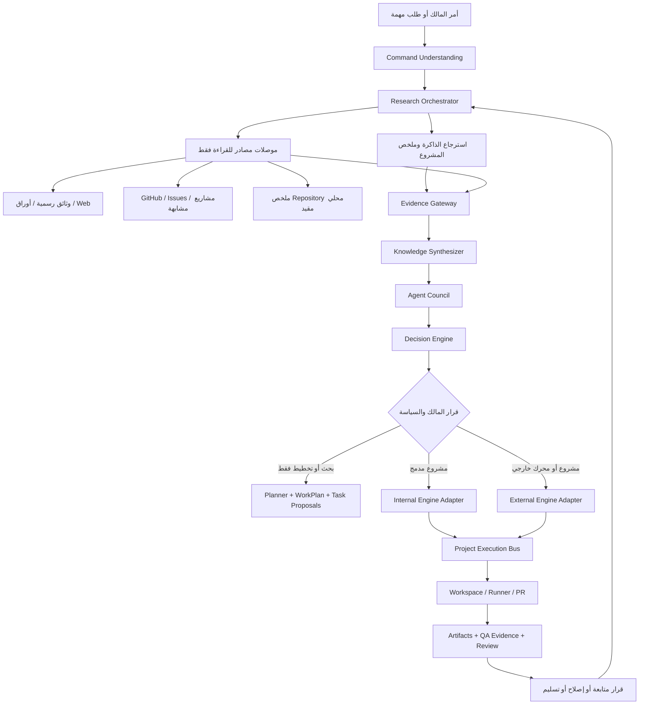

# مخطط طبقة التشاور والبحث ومحركات البناء

**الحالة:** تصور معماري مقترح للإصدار التالي، وليس تفعيلًا تلقائياً لأي موصل خارجي.  
**النطاق:** تحويل أمر بناء تطبيق أو حل مشكلة برمجية إلى بحث منظم، أدلة قابلة للتدقيق، تشاور بين الأدوار، قرار مملوك، ثم تنفيذ محكوم داخل Workspace أو عبر محرك خارجي.

> **القرار التصميمي:** يصبح Agent Command Hub طبقة **قيادة ومعرفة وقرار** فوق محركات البناء؛ لا يحاول تقليد كل بيئة تنفيذ أو منح أي نموذج Terminal أو Git أو أسراراً مفتوحة. تظل كل كتابة أو اختبار أو Pull Request فعلاً محدداً بعقد وسياسة وموافقة.

## 1. لماذا هذه الطبقة، ولماذا الآن؟

المشروع يملك بالفعل حوكمة المشروع، وModel Gateway، وخطة عمل، وAgent Execution للمخطط، وWorkspace منطقية، وRunner محلياً مقيداً. لكن هذه القدرات ما زالت تحتاج طبقة تجمع المعرفة الخارجية وتفصلها عن القرار والتنفيذ. التقرير السابق يصف الفجوة بدقة: Agent Runtime وTask Engine وTool calling لا يشكلون دورة واحدة متصلة ومدعومة بالأدلة بعد.[1]

طبقة **Research & Consultation Fabric** لا تستبدل `Task Engine` أو `Planner` أو `Runner`. بل تضيف قبلها وبينها دورة منهجية: فهم الطلب، تفكيك أسئلة البحث، استرجاع الذاكرة والمستودع والمصادر الخارجية، تقييم الأدلة، مقارنة البدائل، قرار صريح، ثم توجيه التنفيذ إلى مشروع مدمج أو محرك خارجي مناسب. هذا متسق مع منصات الوكلاء الحديثة التي تفصل بين البحث والخطة والتغيير على فرع ومراجعة PR، مع الاحتفاظ بالحماية والمراجعة البشرية.[2] [3]

| النتيجة المطلوبة | ما ستضيفه الطبقة | ما لن تضيفه تلقائياً |
|---|---|---|
| فهم فكرة تطبيق جديدة | أسئلة بحث منظمة، بدائل معمارية، ومصفوفة تكلفة/مخاطر. | اختيار تقنية أو بدء مشروع بلا قرار مالك. |
| حل مشكلة في مشروع قائم | تحليل مستودع وIssues ووثائق وأدلة تشغيل منقحة. | قراءة ملفات جهاز المالك أو رفع محتوى مستودع خاص إلى مزود خارجي بلا موافقة. |
| الاستفادة من خبرات خارجية | مجلس أدوار، مصادر موثقة، ومحولات Engines قابلة للاستبدال. | الثقة في محتوى README أو صفحة ويب أو نتيجة Agent كمصدر أو أمر تنفيذ موثوق بذاته. |
| بناء تطبيق | خطة تنفيذ، اختيار Internal/External Engine، ومخرجات PR أو Artifact. | دمج `main` أو النشر أو الدفع الخفي أو تشغيل shell عام. |

## 2. النموذج التشغيلي المستهدف



> **قاعدة الثقة:** ينتقل محتوى الويب أو مستودعات الآخرين أو نتائج Agent خارجي عبر `Evidence Gateway` كبيانات غير موثوقة. لا تمر التعليمات الموجودة فيها إلى prompts أو أدوات التنفيذ كأوامر؛ تحفظ كادعاءات ومقتطفات منقحة قابلة للمراجعة.

## 3. المكونات المقترحة وحدودها

| المكوّن | المسؤولية | مدخلاته | مخرجاته | الصلاحية |
|---|---|---|---|---|
| Command Understanding | تحويل الأمر إلى هدف ونطاق وقيود وأسئلة ناقصة. | أمر المالك وموجز المشروع. | `research_brief`. | AUTO داخلي؛ لا تنفيذ. |
| Research Orchestrator | اختيار مستويات البحث والأسئلة والميزانية وإيقاف التوسع. | `research_brief` وسياسة تكلفة. | حملة بحث وحالاتها. | AUTO في وضع القراءة. |
| Source Connectors | جلب وثائق أو نتائج أو metadata من مصدر مسموح. | سؤال ونطاق مصدر. | مصدر خام ومقتطفات. | READ-ONLY؛ لا secrets عامة. |
| Evidence Gateway | تنقيح المحتوى وتسجيل المصدر وتقييم الموثوقية وكشف التعليمات. | مصدر خام. | Evidence وClaims مفصولة. | AUTO؛ لا أدوات. |
| Knowledge Synthesizer | دمج الادعاءات، كشف التعارض، تلخيص الثقة والثغرات. | Evidence منشور. | حزمة معرفة مرجعية. | AUTO؛ مخرج قابل للمراجعة. |
| Agent Council | أدوار خبرة مستقلة تقدم proposal/evidence/risk/confidence. | حزمة معرفة وسؤال محدد. | آراء ومقارنات. | اقتراح فقط؛ لا تنفيذ. |
| Decision Engine | تحويل البدائل إلى Recommendation مع أثر وقرار مطلوب. | رأي المجلس وسياسة المشروع. | `decision_draft`. | REVIEW أو APPROVAL بحسب الأثر. |
| Engine Adapter Registry | توحيد المحركات الداخلية والخارجية واكتشاف قدراتها. | موصل معتمد وsession scope. | capabilities وخطة session. | لا تشغيل من دون موافقة وسياق. |
| Project Execution Bus | يربط قراراً مع WorkPlan وTask Engine وArtifacts وRunner أو PR. | قرار معتمد. | تنفيذ قابل للتتبع. | Policy Gateway إلزامي. |

## 4. طبقة الأدلة والمعرفة

### 4.1 نموذج بيانات مقترح

تُضاف هذه الجداول بجانب `memory_items` و`artifacts` و`decisions` القائمة، ولا يُعاد بناء مصادر الحقيقة الحالية.

| الكيان المقترح | الحقول الأساسية | سبب الحفظ |
|---|---|---|
| `research_campaigns` | `project_id`, السؤال، النوع، الحالة، budget، owner decision. | تتبع البحث كوحدة لها حدود ونتيجة. |
| `research_questions` | نوع السؤال، الأولوية، المصدر المطلوب، الحالة. | منع بحث واسع وغير قابل للقياس. |
| `evidence_sources` | URL/معرف مصدر، العنوان، المؤلف، تاريخ الجلب، hash، نوع المصدر، trust tier. | معرفة أصل المعلومة وتغيرها. |
| `evidence_claims` | الادعاء، المقتطف المنقح، relevance، reliability، contradiction group. | منع خلط النص الخام بالقرار. |
| `council_opinions` | role، proposal، risks، confidence، claim ids. | فصل رأي الوكيل عن الدليل الذي استند إليه. |
| `research_syntheses` | consensus، conflicts، unknowns، recommendation candidates. | إعادة استخدام المعرفة بلا إعادة بحث. |
| `engine_connections` | engine key، scopes، trust level، owner-approved config reference. | عزل إعداد المحرك عن منطق المهمة. |
| `engine_sessions` | adapter، correlation id، budget، status، branch/PR/artifact refs. | ربط أي تشغيل خارجي بصاحب وسقف وأدلة. |

### 4.2 سلم الثقة

| المستوى | أمثلة | الاستخدام المسموح |
|---|---|---|
| A — مصدر أولي | توثيق رسمي، مواصفة، API رسمية، مستودع المورد. | أساس قرار تقني عند وجود صلة مباشرة. |
| B — دليل مشروع | كود المشروع، نتائج Runner، CI، PR، Artifact معتمد. | أساس قرار تنفيذ داخل المشروع. |
| C — مصدر ثانوي | مقال تقني موثق أو شرح مجتمع ذي صلة. | يولد فرضية أو سؤال تحقق، لا قرار منفرد. |
| D — محتوى غير موثوق | Issues، README خارجي، snippets، نص Agent. | سياق بحث فقط؛ لا يعبر إلى Tool input. |

لا تستخدم نسبة إجماع رقمية مثل `82%` كدليل مستقل؛ فالثقة تظل نتيجة قابلة للتفسير: **مصدران مستقلان على الأقل، صلة واضحة بالسؤال، ولا تعارض حرج غير محلول**. عند وجود تعارض، ينتج النظام `conflict_record` وسؤال مراجعة بدلاً من ترجيح صامت.

### 4.3 ميزانية البحث وسلّم التصعيد

يمنع `Research Budget` تضخم التكلفة والسياق. تبدأ الحملة من المعرفة المحلية وملخص المشروع ثم تنتقل فقط عند ثغرة محددة أو ثقة منخفضة.

| المستوى | المصدر | شرط الانتقال | حد افتراضي مبدئي |
|---|---|---|---|
| 0 | الذاكرة والقرارات السابقة | غياب نتيجة محلية صالحة. | دون LLM خارجي. |
| 1 | ملخص المستودع وWorkspace المنطقية | الحاجة إلى فهم المشروع الحالي. | 12 ملف metadata أو مراجع منقحة. |
| 2 | وثائق رسمية | حاجة إلى API أو مكتبة أو مواصفة. | 6 مصادر. |
| 3 | بحث ويب/GitHub قراءة فقط | لم تحسم الوثائق أو الحاجة إلى أمثلة/بدائل. | 10 مصادر و3 استعلامات. |
| 4 | خبير واحد | تعارض أو سؤال تخصصي لا يحل بالملخص. | تشغيل واحد محجوز التكلفة. |
| 5 | مجلس متعدد الأدوار | قرار معماري واسع أو أثر أمني/تكلفة مرتفع. | 3–5 أدوار. |
| 6 | محرك بناء خارجي | قرار تنفيذ معتمد وسياق مقيد. | جلسة واحدة/فرع واحد/PR واحد. |
| 7 | قرار المالك | قبل تطبيق/PR/نشر/حذف/ربط سر. | إلزامي للإجراءات الحساسة. |

تتوقف الحملة عندما توجد أدلة كافية ولا تعارض حرج، أو عند بلوغ عدد الجولات أو المصادر أو تكلفة الحملة، أو عندما تتطلب فجوة المعرفة سؤالاً من المالك.

## 5. مجلس الوكلاء ونظام القرار

لا يقرر مجلس الوكلاء بالإجماع الآلي. كل دور ينتج بنية موحدة، ثم يعرض `Knowledge Synthesizer` التوافق والتعارض للمالك.

```ts
type CouncilOpinion = {
  role: "research" | "architecture" | "product" | "ux" | "security" | "database" | "mobile" | "devops" | "cost" | "qa";
  proposal: string;
  evidenceClaimIds: number[];
  risks: string[];
  assumptions: string[];
  confidence: "low" | "medium" | "high";
  requestedDecision?: "auto" | "review" | "approval";
};
```

| نوع القرار | مثال | من يوصي | من يقرر | المخرج |
|---|---|---|---|---|
| اختيار مكتبة | مكتبة barcode أو offline cache. | Mobile + Security + Cost. | المالك عند أثر واسع؛ وإلا REVIEW. | Architecture Decision مع روابط الأدلة. |
| مشروع مثال | قراءة مشروع مفتوح لفهم pattern. | Research. | AUTO للقراءة من مصدر مسموح. | Evidence source فقط. |
| استنساخ/تحميل مشروع خارجي | جلب كود أو dependencies. | Architecture + Security. | APPROVAL. | Sandbox request محدد النطاق. |
| تنفيذ خارجي | طلب Agent خارجي يعمل على فرع. | Planner + Reviewer. | APPROVAL. | Engine session + branch/PR. |
| دمج أو نشر | دمج PR أو APK/Release. | Reviewer + Release. | APPROVAL مستقل. | قرار ومرفقات تحقق. |

## 6. معيار موحد لمحركات البناء

يقترح Hub عقداً صغيراً للمحولات، لا بروتوكولاً ينسخ كل API لمزود. يدعم `prepare` و`plan` في وضع الاقتراح أولاً؛ ولا تُفعل `execute` قبل إضافة Policy Gateway وإثبات Runner E2E.

```ts
type AgentEngineAdapter = {
  key: string;
  capabilities: {
    research: boolean;
    workspace: "none" | "read" | "sandboxed_write";
    git: "none" | "pr_only";
    testing: "none" | "sandboxed";
    streaming: boolean;
  };
  prepare(input: EngineSessionInput): Promise<EngineSessionDraft>;
  research(input: ResearchTask): Promise<EngineResearchResult>;
  plan(input: PlanningTask): Promise<EnginePlanProposal>;
  execute?(input: ApprovedExecutionTask): Promise<EngineHandle>;
  collectArtifacts(handle: EngineHandle): Promise<EngineArtifact[]>;
  cancel(handle: EngineHandle): Promise<void>;
};
```

| المحول | أول وضع مسموح | الحد المطلوب |
|---|---|---|
| `InternalPlannerAdapter` | خطة ومهام مقترحة فقط. | Model Gateway الحالي وحجز التكلفة ومفسر مخرجات. |
| `LocalRunnerAdapter` | static check لحزمة TypeScript معتمدة. | Docker محلي، بلا شبكة، وموافقة؛ ما زال اختبار جهاز المالك مطلوباً. |
| `GitHubAgentAdapter` | إنشاء مهمة/جلسة أو PR قابل للمراجعة. | `pr_only`، ربط صاحب، وسياسات GitHub المفعلة. GitHub يصف عمل الوكلاء الخارجيين كجلسات تنتهي بطلب مراجعة وPR.[2] |
| `OpenHandsAdapter` | قراءة/خطة/اقتراح في Sandbox مستقل. | لا secrets أو filesystem للمستخدم؛ OpenHands يوفر أدوات shell/ملفات/ويب وMCP، لذلك يصنف عالي الخطورة.[4] |
| `MCPConnectorAdapter` | موارد وTools مدرجة في allowlist. | موافقة لكل tool، scopes منفصلة، منع اكتشاف URLs الحر وتمرير الرموز. مواصفة MCP تنص على موافقة المستخدم ومعاملة الأدوات كقدرات خطرة.[6] |

## 7. بوابات الأمن والخصوصية

يشدد هذا التصميم على أن «محرك خارجي» ليس مجرد نموذج آخر. مصادر الويب قد تحتوي تعليمات خصمية، وخادم MCP محلي قد ينفذ أوامر بامتيازات المستخدم، كما أن اكتشاف OAuth أو URL غير المقيد يمكن أن يخلق مخاطر SSRF أو token passthrough.[7]

| البوابة | قاعدة ملزمة | تطبيق أولي |
|---|---|---|
| محتوى غير موثوق | لا ينفذ ولا يضاف إلى System Prompt كتعليمات. | فصل `claim` و`evidence` عن `instruction`. |
| Egress | لا URL حر ولا عنوان داخلي ولا redirect غير مفحوص. | allowlist، HTTPS، وproxy لاحقاً عند موصلات MCP. |
| أسرار | لا تمرر tokens من العميل إلى المحرك أو MCP. | Secrets خادمية مرجعية وscope قصير العمر؛ لا token passthrough.[7] |
| Workspace | لا upload للكود أو السماح بالملفات إلا بسياق مصرح ومحدد الإصدار. | `Context Snapshot` منقح ومقفول. |
| أدوات | tool call من النموذج = اقتراح، لا تنفيذ. | Zod + Policy Gateway + approval + audit. |
| Git | فرع وPR فقط، لا merge أو force push. | سياسة Git الحالية وإعادة فحص جودة. |
| تكلفة | سقف للحملة والجلسة والأدوار الخارجية. | حجز/تسوية موجودان، ثم usage من المحول لاحقاً. |

## 8. ربط الطبقة بالقدرات الحالية

| القدرة الحالية | موضع الربط | التوسعة المطلوبة |
|---|---|---|
| `agent-model-gateway` و`agent-model-service` | تشغيل Research/Architecture Council كمخرجات JSON. | schemas للأدلة والآراء، timeout وidempotency. |
| `agent_execution` وPlanner Interpreter | تحويل توصية معتمدة إلى WorkPlan ومهام مقترحة. | ربط execution بخطوة بحث وحملة وسجل قرار. |
| `Task Engine` | يعلّق عند `awaiting_review/approval` ويتابع بعد القرار. | Step types: research, synthesize, decide, engine-session. |
| `memory_items` وArtifacts | حفظ معرفة منقحة وأدلة قابلة للاسترجاع. | provenance وTTL وحقول ثقة وتعارض. |
| `workspace` و`repository_scans` | تحليل المشروع من metadata أو ملفات مصرح بها. | Context Snapshot واختيار ملفات واضح. |
| `approvals` | اختيار محرك، مشاركة كود، تشغيل، PR، دمج، نشر. | decision templates ترتبط بالحملة أو session. |
| `local-runner` | تحقق محدود بعد موافقة. | Runner E2E على جهاز المالك قبل أي دورة QA فعلية. |
| `gitGate` | مخرج أي محرك خارجي يمر عبر PR. | Engine artifact يحفظ branch/PR/ref فقط. |

## 9. خارطة التنفيذ المقترحة

### المرحلة 0 — العقد والحوكمة

يُنشأ `research_campaign` يدوي من أمر المالك، مع تصنيف السؤال، سقف مصادر وجولات وتكلفة. تضاف `Evidence Gateway` في وضع قراءة فقط وSource Registry للوثائق الرسمية وGitHub metadata. معيار القبول هو أن ينتج بحث عن مكتبة أو نمط Mobile تقريراً بأدلة قابلة للنقر وتعارضات وأسئلة مفتوحة، من دون أي صلاحية code أو connector خارجي.

### المرحلة 1 — المعرفة والتشاور

تضاف Claims وCouncil Opinions وSynthesizer منظم. يبدأ المجلس بثلاثة أدوار فقط: Architecture وSecurity وMobile/UX وفق نوع السؤال. يخرج النظام ببديلين إلى خمسة، ولكل بديل evidence، افتراضات، تكلفة، أثر على المشروع وقرار مطلوب. معيار القبول هو أن يستطيع المالك اعتماد قرار معماري أو رفضه، ويعاد استعماله في Planner Context لاحقاً.

### المرحلة 2 — القرار والتخطيط

يربط القرار المعتمد بـPlanner الحالي، ثم تتحول الخطة المعتمدة إلى مهام مقترحة قابلة للتعديل، وهي قدرة موجودة الآن. تُضاف تبعيات مقترحة وتعيين وكيل مقترح فقط، من دون إنشاء أو تشغيل تلقائي. معيار القبول هو إعادة تشغيل مسار قرار → خطة → مهام من نفس الأدلة بصورة قابلة للتدقيق.

### المرحلة 3 — المحولات في وضع الاقتراح

يُنفذ `AgentEngineAdapter` أولاً لـ Internal Planner وGitHub في نمط PR فقط، ثم OpenHands في وضع read/plan داخل Sandbox منفصل. لا تضاف MCP أو أسرار أو local commands في هذه المرحلة. معيار القبول هو إنشاء Session مسجلة وجمع Artifacts وطلب review من دون دمج أو نشر.

### المرحلة 4 — أدوات محدودة وتنفيذ مثبت

بعد إثبات Runner على جهاز المالك، يضاف Tool Registry صغير: `workspace.read_selected` و`runtime.request_static_check` فقط. ثم يستدعى QA بالدليل لا باللغة. معيار القبول هو مهمة واحدة تمر من Proposal إلى تحقق Runner إلى QA إلى Review مع cancellation وaudit كاملين.

### المرحلة 5 — تشغيل خارجي وموثوقية

يُنظر في GitHub Agentic Workflows أو محركات خارجية حدثية بعد قياسات حقيقية؛ GitHub نفسه يعتمد write outputs معلنة، بيئات معزولة، وسقوف تكلفة/صلاحيات، وهو نموذج حوكمة مناسب لاختبار الموصل لا نسخه بالكامل.[3] لا يُضاف Redis أو Worker معزول أو Autonomy واسع قبل بيانات ازدحام وE2E موثقة.

## 10. قرارات مطلوبة من المالك قبل التنفيذ

| القرار | الخيارات الأولية | التوصية الحالية |
|---|---|---|
| أول use case للبحث | اختيار مكتبة Mobile، تحليل مشروع مثال، أو تشخيص bug. | اختيار مكتبة/معمارية لتطبيق مدمج؛ أقل حساسية. |
| المصادر الأولى | وثائق رسمية + GitHub metadata، أو الويب المفتوح. | ابدأ بالرسمي وGitHub metadata فقط. |
| أول محرك خارجي | GitHub PR Agent، OpenHands Sandbox، أو لا شيء. | لا محرك خارجي قبل اكتمال Evidence Layer وRunner E2E. |
| مشاركة كود خاص | لا مشاركة، مختارات منقحة، أو سياق كامل. | مختارات منقحة فقط وبـAPPROVAL. |
| سياسة جلسة Agent | plan-only، PR-only، أو execute محلي. | plan-only ثم PR-only؛ التنفيذ المحلي بعد إثبات Runner. |

## 11. معايير عدم الخروج عن النطاق

لا تعتبر الطبقة مكتملة لأن لديها شاشة بحث أو عدة prompts. لا تنتقل إلى البناء الخارجي إلا إذا أثبتت الاختبارات ما يلي:

1. كل Claim يظهر مصدره وتاريخ جلبه ومستوى ثقته وسبب صلته.
2. لا تستطيع نتيجة بحث أو Agent إنشاء Task أو Tool Call أو PR من دون مفسر حتمي وقرار سياسة.
3. يظهر للمالك قبل أي مشاركة كود أو تشغيل خارجي: المحرك، المشروع/الفرع، الملفات أو السياق، scope، التكلفة القصوى والمخرج المتوقع.
4. يمكن إيقاف Campaign أو Engine Session وإعادة عرض خط زمنيها وأدلتها وقراراتها.
5. يبقى `main` محمياً، ولا يعبر أي مخرج Code إلى Git إلا عبر PR وفحوص الجودة.

## المراجع

[1] [تقرير حالة Agent Runtime وLLM Orchestration](./agent-runtime-llm-orchestration-report-ar.md)  
[2] [GitHub Docs — About third-party coding agents](https://docs.github.com/en/copilot/concepts/agents/about-third-party-coding-agents)  
[3] [GitHub Docs — About GitHub Agentic Workflows](https://docs.github.com/en/copilot/concepts/agents/about-github-agentic-workflows)  
[4] [OpenHands — Software Agent SDK](https://docs.openhands.dev/sdk)  
[5] [OpenHands — SDLC Integration](https://docs.openhands.dev/openhands/usage/essential-guidelines/sdlc-integration)  
[6] [Model Context Protocol — Specification](https://modelcontextprotocol.io/specification/2026-07-28)  
[7] [Model Context Protocol — Security Best Practices](https://modelcontextprotocol.io/docs/2026-07-28/tutorials/security/security_best_practices)  
[8] [ملخص مصادر البحث المحفوظة للمشروع](./research-consultation-sources.md)
