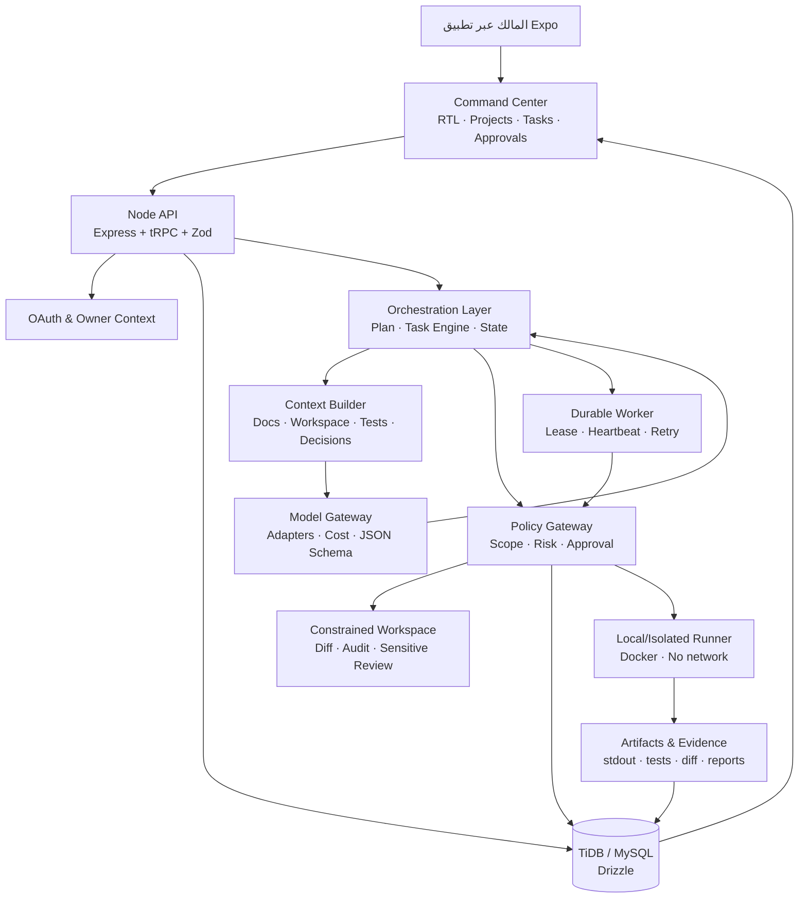

# المواصفات التقنية والهندسة المعمارية لـ Agent Command Hub

**الإصدار:** 1.0  
**الهدف:** تنفيذ منصة شخصية تدير دورة تطوير البرمجيات بالاستعانة بوكلاء الذكاء الاصطناعي، مع فصل واضح بين التخطيط والتنفيذ والمراجعة والموافقة والتسليم.

> **القرار المعماري:** يستمر المشروع كـ **Modular Monolith**: تطبيق جوال + API + قاعدة بيانات + عامل منسق، مع Runner محلي مقيد للتنفيذ. لا يتحول إلى Microservices أو Monorepo متعدد التطبيقات قبل أن تثبت دورة عمل واحدة كاملة على جهاز المالك.

## 1. المتطلبات غير الوظيفية الحاكمة

ليست غاية المنصة إنتاج نصوص من نموذج ذكاء اصطناعي، بل إدارة عمل يمكن تدقيقه. لذلك يجب أن تكون كل مهمة مرتبطة بسياق محدود وخطة ودليل ومراجعة وقرار. لا يجوز لوكيل أن يعلن الإنجاز من دون تحقق، ولا يجوز أن يملك وصولاً مباشراً إلى نظام تشغيل أو Git أو شبكة أو أسرار من دون سياسة وقدرة مثبتة وموافقة مناسبة. [1] [2]

| المتطلب | القرار التقني |
| --- | --- |
| واجهة جوال عربية | Expo وReact Native وTypeScript مع Expo Router ودعم RTL والسمة التلقائية. |
| ملكية وبيانات دائمة | OAuth على مستوى المستخدم، وإجراءات tRPC محمية، وقاعدة بيانات TiDB/MySQL عبر Drizzle. |
| تدفق عمل طويل | Task Engine مبني على حالة دائمة وleases وheartbeat، لا حالة ذاكرة متطايرة. |
| وكلاء ونماذج | استدعاء خادم-فقط عبر Model Gateway، ومخرجات JSON مهيكلة تتحقق بـ Zod. |
| تنفيذ كود | Runner محلي أو Worker معزول، لا تنفيذ مباشر داخل API أو واجهة الجوال. |
| الحوكمة | Approval Engine وسجل تدقيق وفروق وQuality checks وPull Requests. |
| قابلية التوسع | فصل منطقي للوحدات أولاً؛ فصل عمليات/خدمات فقط عند وجود حمل أو احتياج تشغيل محدد. |

## 2. Tech Stack المعتمد

### أ. ما يبنى عليه مباشرة

الاختيار الصحيح هو استكمال الحزم الموجودة بدلاً من استبدالها. هذه الحزم متاحة في المشروع وتغطي الاحتياج الحالي لتطبيق جوال وخادم وبيانات وفحوص جودة. [3]

| الطبقة | التقنية | المسؤولية |
| --- | --- | --- |
| تطبيق الجوال والويب | Expo SDK 54، React Native 0.81، React 19، TypeScript 5.9 | تطبيق iOS/Android/Web، واجهة مركز القيادة، RTL، التنقل والآمان المحلي. |
| التنقل والتصميم | Expo Router 6، React Navigation، NativeWind 4، Tailwind CSS | تبويبات التطبيق والشاشات ومكونات التصميم والحالات الوظيفية. |
| بيانات الواجهة | TanStack Query 5 + tRPC React | التخزين المؤقت، إعادة الجلب، حالات التحميل والخطأ، ومصدر حقيقة API. |
| API | Node.js 22، Express 4، tRPC 11، SuperJSON، Zod 4 | إجراءات محمية، التحقق من المدخلات، عقود مشتركة بين العميل والخادم. |
| الهوية | Manus OAuth + Expo SecureStore على الجوال + cookies محمية على الويب | ربط البيانات بالمالك ومنع عرض مشاريع أو موافقات لغيره. |
| قاعدة البيانات | TiDB/MySQL، Drizzle ORM وDrizzle Kit، mysql2 | مشاريع ومهام ووكلاء وموافقات وWorkspace وRuntime وسجل تدقيق ومخرجات. |
| ملفات/Workspace | تخزين منطقي مقيد في قاعدة البيانات + سياسات مسارات وفروق | منع وصول الوكيل إلى ملفات مضيف أو مسارات غير مصرح بها. |
| تشغيل الكود | Node.js وDocker على جهاز المالك، صورة TypeScript مقفلة من lockfile | تنفيذ JS/TS المستقلين ضمن حاوية بلا شبكة وبحدود موارد. |
| الجودة | Vitest، TypeScript، Expo Lint، Prettier، GitHub Actions | اختبارات وحدات وعقود وفحوص جودة إلزامية قبل الدمج. |
| الإشعارات | Expo Notifications + مركز تنبيهات داخل التطبيق | قرارات الموافقة وتجاوز الميزانية وفشل المهمة. |

### ب. مكونات تضاف لاحقاً لا الآن

لا تحتاج المرحلة الأولى Redis أو Kafka أو Kubernetes أو Vector DB أو محرك Workflow خارجي. يبدأ النظام بصف أوامر وقفل lease في قاعدة البيانات الحالية. عند ثبوت ازدحام فعلي أو حاجة إلى worker مستقل عالي التوافر، يمكن إضافة Queue مخصص، لكن لا يكون ذلك افتراضاً أولياً.

| المكون اللاحق | متى يضاف | سبب عدم إضافته الآن |
| --- | --- | --- |
| Model Gateway | بعد إثبات Runner وربط المهام الحية بالـ API | لا توجد بعد دورة وكيل حية تحتاج تبديل مزودات نماذج. |
| Context Engine | مع أول Planner مهيكل | يمنع إرسال المستودع كاملاً؛ يحتاج قواعد اختيار واقعية من استعمال فعلي. |
| Redis/Queue خارجي | عند الحاجة إلى throughput أو جدولة متعددة العاملين | قاعدة البيانات الحالية تغطي leases وretry للحالة الشخصية الأولى. |
| OpenTelemetry/منصة مراقبة | بعد وجود traffic وتنفيذ فعلي متكرر | سجلات الأحداث وRuntime الحالية هي نقطة البدء الكافية. |
| خدمة Worker مستقلة | بعد قرار بقاء التنفيذ بعيداً عن جهاز المالك | لا تنشأ خدمة دائمة قبل إثبات حالة الاستخدام المقيدة. |
| عزل مشاريع كامل متعدد الشركات | بعد الانتقال من الاستخدام الشخصي | يزيد نطاق الصلاحيات والمصادقة والتكلفة بلا فائدة فورية. |

## 3. الهندسة المعمارية المقترحة



هذه ليست بنية خدمات مستقلة الآن. المربعات المنطقية داخل API يمكن وضعها في مجلدات خادم منظمة، ثم تفصل عملية `Worker` لاحقاً فقط عند اختيار بيئة تشغيل دائمة. يجعل هذا التصميم الاختبارات والمهاجرات والحراسة الأمنية أبسط، بينما يحافظ على حدود واضحة للتوسع.

## 4. الطبقات ومسؤولياتها

### أ. طبقة Command Center

تكون واجهة الجوال مركز قرار، لا سطح تنفيذ. تعرض المشروع والموجز والخطة والمهام والمخرجات والتكلفة والموافقات. تعتمد الشاشات التشغيلية على tRPC وTanStack Query، ولا تستخدم `lib/agent-hub.tsx` بوصفه مصدر حقيقة في وضع الإنتاج. تخزن الواجهة فقط التفضيلات المحلية والحالة المؤقتة، بينما تظل المهمة والموافقة وRuntime في الخادم.

### ب. طبقة API والملكية

تتكون من إجراءات tRPC محمية مع Zod لكل مدخل. يتحقق كل إجراء من المالك وارتباط المشروع قبل القراءة أو الكتابة. تبقى المنطق في `server/db.ts`، والعقود في `server/routers.ts`، والمخطط والمهاجرات في `drizzle/`. هذا يضمن أن الوكلاء لا يستطيعون قراءة مشروع أو اعتماد قرار خارج نطاق المستخدم. [4]

### ج. طبقة Orchestration وTask Engine

تستقبل `ExecutionCommand` أو طلب مشروع، وتنشئ `WorkPlan` ومهاماً مرتبطة بحالات واعتماديات ومعيار إتمام. لا يقوم Orchestrator بتنفيذ أدوات؛ بل يقرر المرحلة التالية وينشئ طلباً قابلاً للمراقبة. تعتمد الحالة على البيانات، وتستخدم lease وheartbeat ووقت انتهاء واستعادة محدودة، حتى لا يتكرر العمل عند انقطاع عامل أو تطبيق.

| حالة المهمة | المعنى | الانتقال المسموح |
| --- | --- | --- |
| `needs_clarification` | مدخلات أو قيود ناقصة. | إلى `planned` بعد استكمال المالك أو اعتماد افتراض معلن. |
| `planned` | يوجد موجز وخطة ومعيار قبول. | إلى `ready` بعد اعتماد نطاق المهمة. |
| `ready` | صالحة للحجز ولا تنتظر قراراً. | إلى `running` بعقد lease. |
| `running` | عامل أو Runner مثبت يتولى المحاولة. | إلى `reviewing` أو `blocked` أو `failed`. |
| `reviewing` | توجد نتيجة QA أو فرق يحتاج تقييم. | إلى `completed` أو `retrying` أو `waiting_approval`. |
| `waiting_approval` | فعل عالي الأثر لا يمكن إتمامه ذاتياً. | إلى `ready` أو `cancelled` وفق القرار. |
| `completed` | دليل القبول متاح ومراجع. | حالة نهائية قابلة للتقرير. |

### د. طبقة الوكلاء وModel Gateway

لا يستدعي تطبيق Expo النموذج مباشرة ولا يخزن مفاتيح مزود النماذج. تتم الاستدعاءات من الخادم عبر واجهة موحدة تحفظ المزود والنموذج والقدرات والزمن والكلفة، وتتحقق من شكل المخرجات قبل أن تصل إلى Workspace أو Task Engine.

```ts
type ModelGateway = {
  run<T>(request: {
    taskId: number;
    role: "orchestrator" | "planner" | "coder" | "qa" | "debugger" | "reviewer" | "release";
    context: ContextPackage;
    outputSchema: unknown;
    budget: { maxTokens: number; maxCost: number; timeoutMs: number };
  }): Promise<{ output: T; usage: ModelUsage; evidenceId: string }>;
};
```

يبدأ التنفيذ بمزود واحد أو اثنين فقط. لا يختار النظام نموذجاً «أفضل» بصورة عامة؛ بل يختاره بناءً على مهمة محددة وحد تكلفة وسقف زمن وقدرات مطلوبة. يرفض أي output لا يطابق Zod/JSON Schema قبل تسجيله مخرجاً قابلاً للتنفيذ.

| دور الوكيل | مدخل محدود | مخرج مهيكل | لا يسمح له |
| --- | --- | --- | --- |
| Orchestrator | طلب المالك وحالة المشروع والمخاطر. | موجز وتنقل مرحلة. | تعديل ملفات أو تشغيل أدوات. |
| Planner | موجز وسياق مشروع محدود. | خطة ومهام وأسئلة ومعايير قبول. | اعتماد الخطة أو التنفيذ. |
| Coder | مهمة وسياق وملفات مختارة وسياسة أدوات. | فرق مقترح أو مسودة محدودة. | نشر أو دمج أو أسرار. |
| QA | فرق ودليل وتشغيلات مسموحة. | تقرير تحقق PASS/FAIL. | تعديل الكود مباشرة في البداية. |
| Debugger | فشل ودليل وسجل محاولات. | فرضيات وفحص تالي وإصلاح مقترح. | إعادة محاولات مفتوحة. |
| Reviewer | خطة وفرق وQA ومخاطر. | قرار مراجعة أو ملاحظات. | تجاوز Approval أو تعديل حساس. |
| Release | أدلة بناء ومهاجرات وخطة رجوع. | قائمة جاهزية للإصدار. | النشر الفعلي من دون APPROVAL. |

### هـ. Context Builder

يمنع Context Builder إرسال المشروع كله في كل استدعاء. ينشئ `ContextPackage` من موجز المشروع، المهمة، القرارات، الملفات التي اختيرت من Workspace، الفروق، نتائج QA، والحدود. كل حزمة تسجل سبب اختيار المحتوى وحجمها وهوية المصدر. يكون الاختيار افتراضياً read-only؛ أما المحتوى الحساس فينقح أو يستبعد بحسب السياسة.

### و. Policy Gateway وApproval Engine

كل Tool أو إجراء يمر عبر بوابة موحدة قبل التنفيذ. تتحقق البوابة من المالك والمشروع والمسارات ومخاطر العملية وحالة الموافقة وسقف التكلفة. لا تكون الموافقة نصاً في prompt فقط، بل صفاً دائماً يعلق التنفيذ حتى القرار.

| مستوى القرار | أمثلة | التنفيذ |
| --- | --- | --- |
| `AUTO` | قراءة محدودة، تحليل، توليد خطة، فرق غير حساس، typecheck بلا أثر. | ينفذ مع سجل. |
| `REVIEW` | تعديل واسع، تبعية جديدة، تغيير مصدر بيانات واجهة، توسعة سياسة. | يعرض البدائل والأثر قبل المتابعة. |
| `APPROVAL` | تشغيل Runner، Git push/merge، حذف، شبكة خارجية، نشر، أسرار، migration إنتاجية. | يتوقف حتى قرار المالك والدليل بعد الإجراء. |

### ز. Workspace وArtifact Store

Workspace منطقية ومقيدة بالمسارات المعتمدة. تتم الكتابة بمسودة وdiff، والتغييرات الحساسة تمر بمراجعة ثانوية. `Artifact` لا يعني ملفاً عشوائياً على الخادم؛ بل سجل نتيجة قابل للمراجعة مثل diff، تقرير QA، stdout/stderr منقح، خطة أو وثيقة. هذا يحفظ قابلية الإرجاع ويجعل الشاشات تعرض أدلة مرتبطة بالمهمة.

### ح. Runtime وRunner

يبقى API بلا Docker ولا وصول إلى نظام تشغيل. يرسل الخادم طلباً معتمداً إلى Runner مرتبط أو Worker معزول. المرحلة الحالية تدعم JS/TS مستقلين فقط، في `source/` أو `tests/`، بلا imports أو حزم أو شبكة أو `process.env`، مع Docker غير جذري وشبكة معطلة وجذر قراءة فقط وحدود 15 ثانية و256MB و0.5 CPU. [5]

لا توسع هذه الطبقة إلى بناء مشروع كامل أو Git أو نشر قبل أن يثبت اختبار الجهاز الحالي. عند الحاجة لاحقاً إلى اختبارات متعددة الملفات، تنشأ **قدرة مستقلة** وسياسة وصورة حاوية وموافقة منفصلة؛ لا يغير Coder قيد Runner داخل prompt.

## 5. خيارات تشغيل العامل الدائم

يختار المالك بعد إثبات Runner إحدى طريقتين، ولا يفترض النظام أن إحداهما تعمل من دون قرار أو بيئة.

| النهج | مناسب عندما | المزايا | القيود |
| --- | --- | --- | --- |
| Runner محلي على جهاز المالك | التنفيذ حساس أو يعتمد على جهاز وDocker المالك، والمالك يقبل بقاء الجهاز متصلاً. | لا يحتاج نقل ملفات المشروع أو أسرارها إلى خادم؛ يطابق القدرة الحالية. | يتوقف عند إغلاق الجهاز أو Docker، ولا يصلح لمتابعة غير منقطعة. |
| Worker خلفي مُدار | مهام orchestration أو تحقق لا تحتاج Docker أو تصلح ضمن بيئة خادم مقيدة. | استمرار ومراقبة وleases من دون جهاز المالك. | يحتاج تشغيل دائم وقيود موارد واضحة؛ لا ينفذ Docker أو أدوات نظام خارج بيئة معتمدة. |
| Worker معزول مستقل | بناء مشاريع أو Docker أو أدوات نظام أو موارد تتجاوز الخادم المدار. | عزل أقوى وتحكم في الأدوات والموارد. | يحتاج بيئة Linux ثابتة وإدارة صور وأسرار ومراقبة؛ يختار فقط عند إثبات حاجة حقيقية. |

## 6. بنية الملفات المستهدفة داخل Modular Monolith

لا يغير هذا التنظيم أسماء واجهة التطبيق أو يفرض نقلها إلى حزم مستقلة. يضيف حدوداً منطقية قابلة للاختبار داخل الخادم الحالي.

```text
server/
  agents/
    orchestrator.ts
    planner.ts
    coder.ts
    qa.ts
    reviewer.ts
    contracts.ts
  model-gateway/
    types.ts
    adapter.ts
    provider-registry.ts
    usage-meter.ts
  context/
    context-builder.ts
    redaction.ts
    selection-policy.ts
  orchestration/
    work-plan.ts
    task-state-machine.ts
    retry-policy.ts
  policies/
    tool-policy.ts
    approval-policy.ts
    cost-policy.ts
  runtime/
    execution-dispatcher.ts
    runner-contract.ts
  db.ts
  routers.ts
```

## 7. الأمن والخصوصية والعمليات

| المجال | المواصفة |
| --- | --- |
| الأسرار | تحفظ في إعدادات الخادم فقط، وتستثنى ملفات إعداد Runner المحلية من Git. لا تمر المفاتيح إلى تطبيق الجوال أو Logs أو prompts. |
| السجلات | stdout/stderr وprompts المنقحة مقتطعة، مع معرفات مرجعية لا محتوى أسرار. |
| العزل | لا mounts لمجلدات المستخدم أو Docker socket داخل حاوية التنفيذ، ولا شبكة افتراضية. |
| الصلاحيات | ملكية المستخدم تتحقق في كل tRPC procedure، وقدرات الأدوات تحدد لكل مهمة ومشروع. |
| الاعتمادية | lease وheartbeat ووقت انتهاء ومحاولات محدودة وسبب توقف واضح. |
| GitHub | تغييرات الفرع الرئيسي عبر Pull Request وفحص جودة، ودمج/دفع ضمن APPROVAL. |
| الاستعادة | أي تغيير حساس يحتفظ بالفرق والنسخة الأساسية وخطة رجوع قبل التطبيق. |

## 8. مسار الانتقال العملي

| المرحلة | التغيير | معيار الخروج |
| --- | --- | --- |
| 0 | قرار PR #4 واختبار Runner محلي JS/TS مع رفض وإلغاء موثقين. | دليل تشغيل حقيقي أو `environment_required` صريح. |
| 1 | تحويل لوحة المهام وملخصات المشروع إلى مصدر tRPC واحد. | مهمة حقيقية تظهر وتتغير في الواجهة بعد mutation. |
| 2 | إضافة `ProjectBrief` و`WorkPlan` و`ContextPackage` مهيكلة. | طلب مالك يتحول إلى خطة قابلة للمراجعة بلا تنفيذ تلقائي. |
| 3 | إضافة Model Gateway بمزود محدود وZod outputs وسجل تكلفة. | Planner ينتج خطة مسجلة من استدعاء خادم-فقط. |
| 4 | دورة صغيرة Planner → Coder → QA → Reviewer داخل Workspace. | فرق محدود يملك QA ومراجعة وموافقة عند الحاجة. |
| 5 | اختيار Worker دائم أو Runner محلي، ثم E2E وAndroid smoke ومراقبة. | تدفق حرج مثبت ودليل تشغيل واستعادة متاحان. |

## 9. قرارات المالك المطلوبة قبل التنفيذ التالي

1. هل يدمج PR #4، الذي يحتوي توسعة Runner والمهاجرات والاختبارات، بعد أن اجتاز فحص الجودة؟
2. هل تكون أول حالة استخدام للـ Runner: ملف TypeScript حسابي، اختبار محدد، أم تحليل ساكن فقط؟
3. هل تبقى مهمة المتابعة على جهاز المالك أولاً، أم يبدأ لاحقاً Worker خلفي للمهام التي لا تحتاج Docker؟
4. ما أول مزود نموذج مسموح به لـ Model Gateway، وما سقف التكلفة لكل مشروع ومهمة؟

## المراجع

[1] [تصور المنتج الموحد](./product-vision-ar.md)  
[2] [تقييم المستند وخارطة الاعتماد](./attached-document-assessment-ar.md)  
[3] [الحزم الفعلية للمشروع](../package.json)  
[4] [واجهات API الحالية](../server/routers.ts)  
[5] [عقد Runner المحلي المقيد](./local-runner-contract-ar.md)
